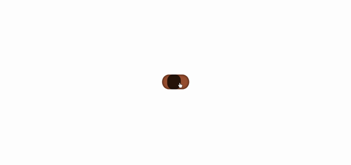
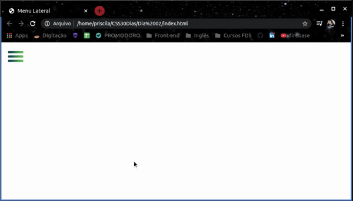
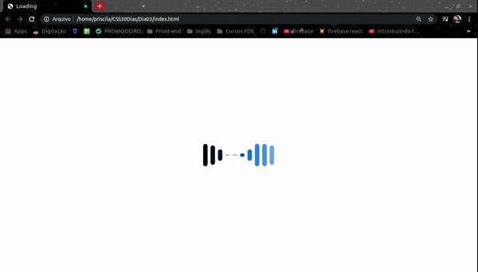
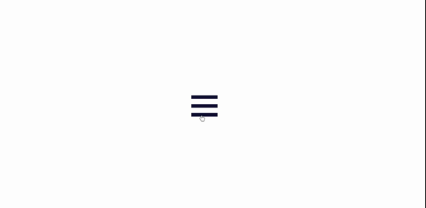
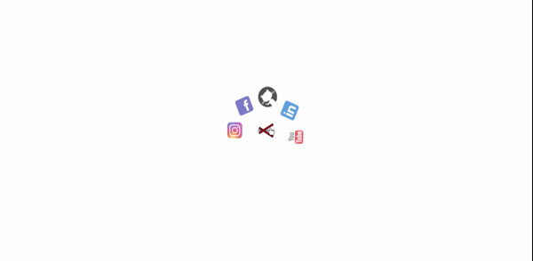
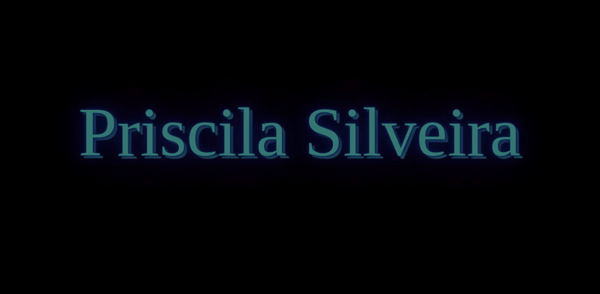
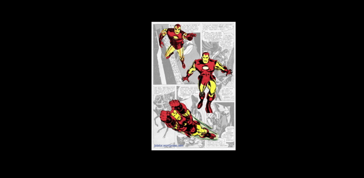
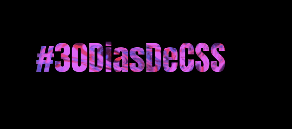

# 30DiasDeCSS 👋

My name is Priscila Silveira 👩🏼‍🇧🇷

- 📍 living in São Paulo
- 💻 Student Front-end  <Laboratória>💛 💻

 👇🏼

 
 
 
 

### 30 dias de CSS3, é um desafio que visa ajudá-lo a melhorar suas habilidades de codificação fazendo mini projetos diários utilizando HTML5 e CSS3 

 ## Objetivo
 
 *Melhorar minhas habilidades em CSS3 através da realização de projetos
 
 *Aprofundar meus conhecimentos em CSS3 🧠
 
 
## Regras

* Realizar um projeto por dia
* Compartilhar meu progresso nas mídias sociais (Linkedin etc.) usando a hashtag #30DiasDeCSS
* O projeto deve ser concluído até 23:59

##  Desafio dia 01 - Toggle Checkbox

##  Desafio dia 02 - Menu Lateral

##  Desafio dia 03 -  Loader animado

##  Desafio dia 04 - Ícone menu hambúrguer animado

##  Desafio dia 05 - Menu Circular

##  Desafio dia 06 - Efeito neon piscando

##  Desafio dia 07 - Box 3D

##  Desafio dia 08 - Background do texto animado

##  Desafio dia 09 - Christmas lights

##  Desafio dia 10 - Efeito Máquina de escrever

##  Desafio dia 11 - Card com efeito hover

